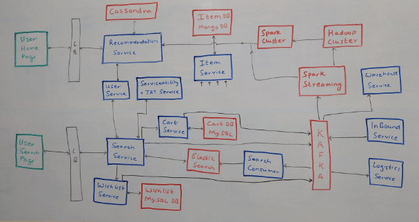

# Amazon System Design

Ngày nay từ đồ điện tử đến quần áo đến đồ gia dụng và cả thuốc men điều có thể được mua trên các trang thương mại điện tử. Thậm chí các cửa hàng tạp hoá cũng có trên Amazon. Vậy câu hỏi là làm thế nào để xây dựng một hệ thống thương mại điện tử với lượng lớn sản phẩm khác nhau, cung cấp các lựa chọn thanh toán mượt mà và đảm bảo không gặp sự cố vào các đợt sales lớn như Black Friday. Hôm nay ta sẽ đi vào tìm hiểu cách xây dựng các hệ thống tương tự như Amazon.

## Các yêu cầu bắt buộc

- Cung cấp chức năng tìm kiếm và chuyển phát ETA.
- Cung cấp danh mục cho tất cả sản phẩm.
- Cung cấp tính năng Cart và Wishlist.
- Xử lý thanh toán mượt mà.
- Cung cấp tính năng xem đơn hàng đã đặt.

## Các yêu cầu không bắt buộc

- Độ trễ thấp
- Tính khả dụng cao
- Tính nhất quán cao

## Kiến trúc hệ thống

Bây giờ, với một hệ thống xử lý lượng truy cập cao như vậy, đặc biệt là trong các đợt sales lớn, việc đáp ứng cả ba yêu cầu không bắt buộc là rất khó. Tuy nhiên, không phải lúc nào mọi thứ cũng cần 3 yêu cầu này. Ví dụ, hệ thống thanh toán và hàng tồn kho sẽ tập trung vào tính nhất quán với chi phí hiện có, chức năng tìm kiếm chỉ cần tính khả dụng cao ngay cả khi nó không nhất quán và các thành phần tương tác người dùng sẽ ưu tiên độ trễ thấp.

Bây giờ khi đã rõ yêu cầu, ta sẽ bắt đầu xây dựng hệ thống. Để đơn giản hoá, ta sẽ chia hệ thống thành hai phần: Home/Search và Purchase/Checkout.

### Home/Seach 

Có hai giao diện người dùng mà chúng ta cần tạo, giao diện trang chủ sẽ là nơi hiển thi các sản phẩm đề xuất cho người dùng tuỳ thuộc vào việc đó là thành viên cũ hay mới và trang tìm kiếm là nơi hiển thị các kết quả dựa trên một số văn bản tìm kiếm.

Bây giờ, một công ty có quy mô lớn như Amazon sẽ tương tác với một lượng lớn nhà cung cấp. Để quản lý các nhà cung cấp này ta cần nhiều dịch vụ gọi chung là là **Dịch vụ hậu cần(Inbound Services)**. Dịch vụ này sẽ tương tác với các hệ thống cung cấp để lấy dữ liệu có liên quan. Khi một nhà cung cấp mới được thêm vào hoặc khi nhà cung cấp thêm một sản phẩm mới vào kho, thông tin này cần được chuyển vào hệ thống để nó có thể khả dụng với người dùng. Thông tin này, một lần nữa sẽ đi vào hệ thống của chúng ta thông qua dịch vụ hậu cần và đến được với người dùng trên trang chủ hoặc thông qua kết quả tìm kiếm thông qua nhiều khách hàng đang nghe Kafka sẽ nhận được các sự kiện từ dịch vụ hậu cần bất cứ khi nào thay đổi xảy ra. 