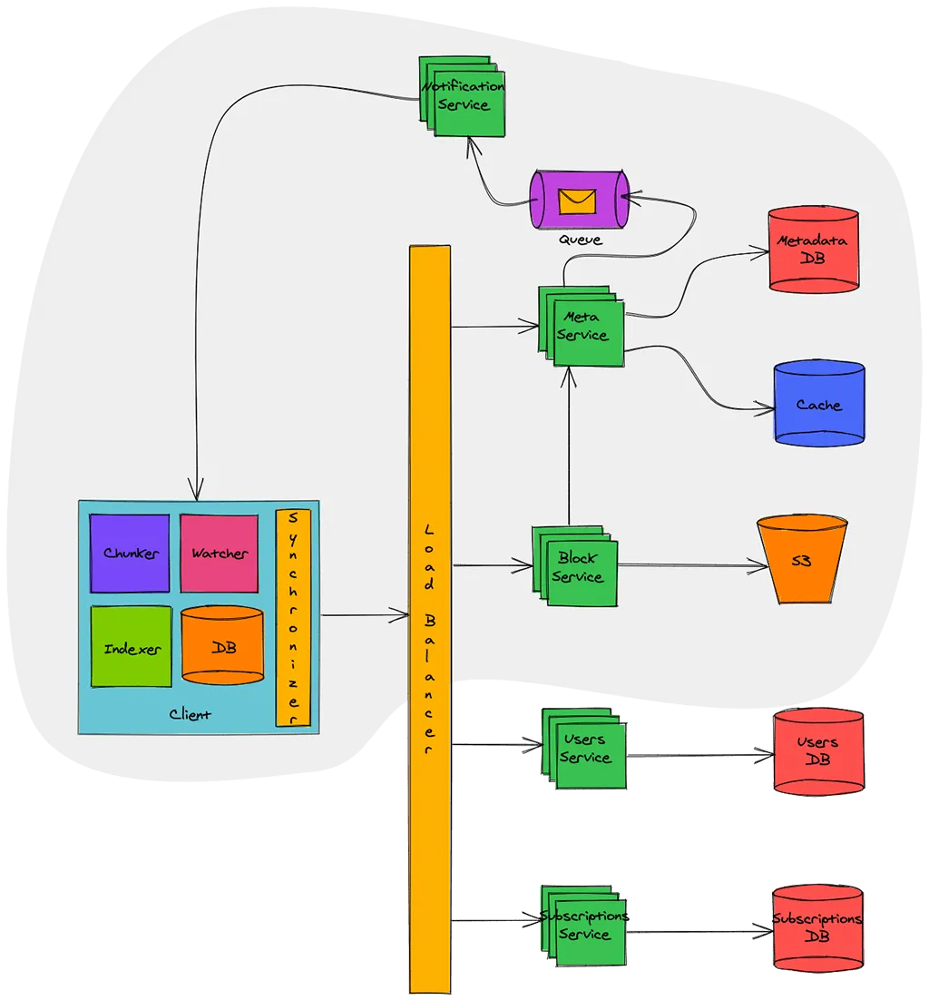
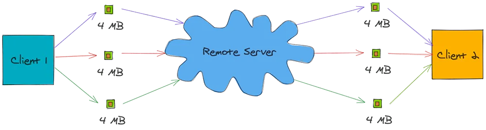

# Thiết Kế Hệ Thống Dropbox

Dropbox là dịch vụ lưu trữ đám máy cho phép người dùng lưu trữ dữ liệu của họ trên máy chủ từ xa. Máy chủ từ xa lưu trữ các file một cách an toàn và bền vũng, đồng thời các file này có thể được truy cập ở bất cứ đâu có Internet.

Trong bài viết này, ta sẽ tập trung vào các tính năng khả dụng, chắn chắn và khả năng mở rộng. Bắt đầu thôi!

## Yêu cầu

Hãy xem xét các yêu cầu bắt buộc và không bắt buộc trước khi thiết kế hệ thống:

### Yêu cầu bắt buộc

1. Người dùng có thể đăng nhập qua email và đăng ký gói data. Nếu họ không đăng ký, thì dung lượng miễn phí là 1GB.
2. Người dùng có thể upload/download từ bất kỳ thiết bị nào.
3. Người dùng có thể chia sẽ file hay thư mục với người khác.
4. Người dùng có thể upload file lên đến 1GB.
5. Hệ thống cung cấp khả năng tự đồng bộ trên thiết bị.
6. Hệ thống cung cấp chế độ chỉnh sửa ngoại tuyến. Họ có thể thêm/sửa/xoá ngoại tuyến, khi họ online trở lại hệ thống sẽ tự đồng bộ với server và thiết bị người dùng.

### Yêu cầu không bắt buộc

1. Hệ thống bảo đảm file không bị mất.
2. Hệ thống luôn khả dụng với người dùng.

### Các yêu cầu khác

1. Cộng tác file thời gian thực
2. Hiển thị phiên bản file

## Ước tính chi phí

Hãy thử tính băng thông và bộ nhớ cần lưu trữ.

### Giả định

1. Số lượng người dùng = 500 triệu
2. Số lượng người dùng hoạt động mỗi ngày = 100 triệu
3. Trung bình file lưu trữ trên một người = 200
4. Kích cở trung bình của file = 100 KB
5. Số lượng kết nối trực tuyến trên một phút = 1 triệu

### Ước lượng bộ nhớ

Tổng số lượng file = 500 triệu * 200 = 100 tỷ
Tổng yêu cầu lưu trữ = 100 tỷ * 100 KB = 10 PB

## Thiết kế các thành phần

Hệ thống cần xử lý một lượng khổng lồ dữ liệu được đọc và ghi và tỷ lệ của chúng là tương đương. Do đó, khi thiết kế hệ thống, ta cần tập trung vào tối ưu dữ liệu thay đổi giữa client và server.

Các dịch vụ cần quan tâm là:

### Dịch vụ người dùng (Users Service)

Có nhiệm vụ chính là xác thực thông tin và hồ sơ người dùng. Dịch vụ này sẽ lấy dữ liệu từ hệ RDBMS như MySQL hay PostgreSQL. Ta cần các thuộc tính ACID mạnh mẽ cho tập dữ liệu vì vậy RDBMS là lựa chon thích hợp.

### Dịch vụ đăng ký (Subscriptions Service)

Được dùng để quản lý đăng ký của người dùng. Vì dữ liệu được xử lý bởi dịch vụ có tính giao dịch cao nên RDBMS là lựa chọn thích hợp.

### Client

Client ở đây là ứng dụng desktop hoặc mobile giữ cho người dùng xem không gian làm việc và đồng bộ file với server. Bên dưới là các chức năng chính của client:

- Xem không gian làm việc.
- Upload/download file từ server.
- Xử lý xung đột khi ngoại tuyến hoặc thay đổi đồng thời.
- Cập nhật metadata của file trên server nếu có thay đổi.

Giả sử rằng ta xây dựng client để đồng bộ file với mỗi thay đổi đến server.

Như trong ảnh bên trên, giả sử rằng ở đây ta có một file với 1GB và ba lần thay đổi mà ta thực hiện trên file này. Vì thế, file được gửi ba lần lên server đồng thời cũng được tải xuống ba lần trên client khác. Trong quá trính này, 3 GB của băng thông được dùng để upload và 3 GB khác dùng cho download. Hơn thế nữa, băng thông ở download sẽ tăng lên khi client xem file.

Vậy là ta cần 6GB băng thông cho một thay đổi nhỏ? Còn nếu nó bị mất khi đang kết nối, client sẽ upload/download toàn bộ lần nữa. Đây là một sự hao tốn băng thông khổng lồ, và ta cần tối ưu nó.

Bây giờ ta sẽ xây dựng một client chia nhỏ file thành các phần nhỏ hơn chẳng hạn như 4 MB, và upload chúng lên server như hình bên dưới:

Nếu có thay đổi nào với file, client sẽ quyết định phần nào thay đổi và chỉ upload phần đó lên server. Giống như vậy, ứng dụng client khác chỉ nhận thông báo về phần thay đổi và download chúng. Với cách này băng thông chỉ dùng 24MB thay vì 6GB như ban đầu.

Hãy ghi nhớ điều này, và xem xét các thành phần khác nhau của ứng dụng client được tối ưu hóa:

**Client Metadata Database**: cơ sở dữ liệu lưu trữ thông tin về các files khác nhau trong không gian làm việc, các phần của file, phiên bản và vị trí trong hệ thống file. Có thể triển khai bằng các cơ sở dữ liệu gọn nhẹ như SQLite.

**Chunker**: chunker chia các file lớn thành các phần nhỏ (4 MB). Có thể tạo file gốc từ các phần này.

**Watcher**: giám sát Watch cho các thay đổi của không gian làm việc như cập nhật, tạo và xoá file hay thư mục. Watch thông báo cho Indexer về các thay đổi.

**Indexer**: Indexer lắng nghe các sự kiện từ watcher và cập nhật Client Metadata Database với thông tin từ phần của file thay đổi. Nó còn thông báo cho Synchronizer sau khi thay đổi cam kết với Client Metadata Database.

**Synchronizer**: lắng nghe các sự kiện từ Indexer và giao tiếp với Meta Service và Block Service cho cập nhật metadata và các phần thay đổi của file trên server tương ứng. Nó còn lắng nghe các thay đổi được phát rộng bởi Notification Service và download phần thay đổi từ server.

### Meta Service

Có nhiệm vụ đồng bộ metadata của file từ client lên server. Nó còn có trách nhiệm tìm ra nhóm thay đổi từ các client khác nhau và phát rộng chúng bằng Notification Service.

Khi một client online, nó ping đến Meta Service cho cập nhật. Meta Service xác định nhóm thay đổi cho client này bằng truy vấn đến Metadata DB và trả về nhóm thay đổi.

Nếu client cập nhật file, Meta Service lần nữa xác định nhóm thay đổi trên các client khác đang xem file và phát rộng nhóm thay đổi này thông qua Notification Service.

Meta Service được hỗ trở bởi Metadata DB. Cơ sở dữ liệu này bao gồm metadata của file như tên, kiểu(file hay thư mục), chia sẻ truy cập, thông tin phần,... Cơ sở dữ liệu này cần các thuộc tính ACID mạnh mẽ. Do đó ta sẽ chọn các RDBMS như MySQL hay PostgreSQL.

Vì truy vấn cơ sở dữ liệu cho từng yêu cầu đồng bộ là các thao tác tốn kém, một in-memory cache được đặt trước Metadata DB. Các truy vấn dữ liệu thường xuyên được lưu trong cache bằng cách này loại bỏ các truy vấn đến cơ sở dữ liệu. Cache có thể triển khai bằng Redis hoặc Memcached và write-around cache strategy có thể được áp dụng để tối ưu hiệu suất.

> Dropbox sử dụng thuật toán claver để đồng bộ hóa hiệu quả các file trên nhiều client. Bạn có thể đọc thêm chi tiết ở [đây](https://dropbox.tech/infrastructure/streaming-file-synchronization)

### Block Service

Block Service tương tác với block storage cho upload và download file. Client kết nối với Block Service để upload/download các phần file.

Khi client hoàn thành download, Block Service thông báo Meta Service để cập nhật metadata. Khi một client tải một file, Block Service hoàn tất tải lên block storage, thông báo đến Meta Service để cập nhật metadata tương ứng cho client này và phát thông điệp đến các client khác.

Block Storage có thể được triển khai bằng hệ thống file phần tán như Glusterfs hay Amazon S3/ Hệ thống file phân tán cung cấp độ bền cao và đảm bảo rằng các file đã tải lên sẽ không bao giờ mất.

> Khi Dropbox bắt đầu, nó sử dụng S3 như block storage. Tuy nhiên khi phát triển, họ tạo một hệ thống lưu trữ gọi là Magic Pocket. Trong Magic Pocket, file được chia thành các blocks, được sao chép để đảm bảo độ bền và được phân phối trên các trung tâm dữ liệu ở nhiều vùng địa lý. 

### Notification Service

Notification Service phát rộng các thay đổi file đến các client đã kết nối để đảm bảo bất kỳ thay đổi nào đến file được phản ánh tất cả các client đang xem ngay lập tức.

Notification Service có thể triển khai bằng HTTP Long Polling, Websockets hoặc Server Sent Events. Websockets thiết lập một kết nối song song liên tục giữa client và server. Nó không tốt cho trường hợp này vì ở đây không cần giao tiếp hai chiều. Ta chỉ cần phát thông điệp từ dịch vụ đến các client do đó ta sẽ không chọn nó.

HTTP Long Polling là lựa chọn tốt hơn vì server giữ kết nối bị treo cho đến khi dữ liệu khả dụng ở máy khác. Một khi dữ liệu khả dụng, server gửi dữ liệu đóng kết nối. Một khi kết nối được đóng, client cần thiết lập lại kết nối mới. Nói chung, với mỗi yêu cầu long poll, nó cần
một thời gian chờ liên kết đến nó và client phải thiết lập một kết nối mới.

HTTP Long Polling is a better choice as server keeps the connection hanging till a data is available for client. Once data is available, server sends the data closing the connection. Once the connection is closed, client has to again establish a new connection. Generally, for each long poll request, there is a timeout associated with it and client must establish a new connection post timeout.

Với Server Sent Events, client thiết lập kết nối lâu dài liên tục với server. Kết nối này được sử dụng để gửi các sự kiện từ server đến client. Không có thời gian chờ và nội dung vẫn tồn tại cho đến khi client vẫn còn trên mạng. Điều này hoàn toàn phù hợp với trường hợp sử dụng của ta và sẽ là một lựa chọn tốt để thiết kế Notification Service. Mặc dù Server Sent Events  không được hỗ trợ trong tất cả các trình duyệt, nhưng ta không phải lo lắng vì có các ứng dụng client cho desktop và mobile được xây dựng tùy chỉnh để chúng ta có thể sử dụng nó.

Notification Service trước khi gủi dữ liệu đến client, nó đọc thông điệp từ một hàng đợi. Hàng đợi này có thể sử dụng RabbitMQ, Apache ActiveMQ hoặc Kafka. Hàng đợi thông điệp cung cấp một giao tiếp bất đồng bộ giữa Meta Service và Notification Service, và vì thế Meta Servie không cần đợi cho đến khi thông báo được gửi đến client. Notification Service có thể tiếp tục sử dụng thông điệp theo tốc độ của riêng mình mà không ảnh hưởng đến hiệu suất Meta Service.Việc tách này cũng cho phép chúng ta mở rộng quy mô cả hai dịch vụ một cách độc lập.
