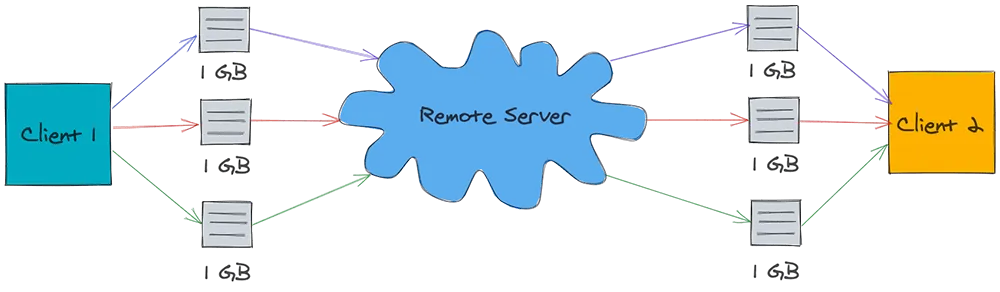

# Thiết Kế Hệ Thống Dropbox


Dropbox là dịch vụ lưu trữ đám máy cho phép người dùng lưu trữ dữ liệu của họ trên máy chủ từ xa. Máy chủ từ xa lưu trữ các file một cách an toàn và bền vũng, đồng thời các file này có thể được truy cập ở bất cứ đâu có Internet.

Trong bài viết này, ta sẽ tập trung vào các tính năng khả dụng, chắn chắn và khả năng mở rộng. Bắt đầu thôi!

## Yêu cầu

Hãy xem xét các yêu cầu bắt buộc và không bắt buộc trước khi thiết kế hệ thống:

### Yêu cầu bắt buộc

1. Người dùng có thể đăng nhập qua email và đăng ký gói data. Nếu họ không đăng ký, thì dung lượng miễn phí là 1GB.
2. Người dùng có thể upload/download từ bất kỳ thiết bị nào.
3. Người dùng có thể chia sẽ file hay thư mục với người khác.
4. Người dùng có thể upload file lên đến 1GB.
5. Hệ thống cung cấp khả năng tự đồng bộ trên thiết bị.
6. Hệ thống cung cấp chế độ chỉnh sửa ngoại tuyến. Họ có thể thêm/sửa/xoá ngoại tuyến, khi họ online trở lại hệ thống sẽ tự đồng bộ với server và thiết bị người dùng.

### Yêu cầu không bắt buộc

1. Hệ thống bảo đảm file không bị mất.
2. Hệ thống luôn khả dụng với người dùng.

### Các yêu cầu khác

1. Cộng tác file thời gian thực
2. Hiển thị phiên bản file

## Ước tính chi phí

Hãy thử tính băng thông và bộ nhớ cần lưu trữ.

### Giả định

1. Số lượng người dùng = 500 triệu
2. Số lượng người dùng hoạt động mỗi ngày = 100 triệu
3. Trung bình file lưu trữ trên một người = 200
4. Kích cở trung bình của file = 100 KB
5. Số lượng kết nối trực tuyến trên một phút = 1 triệu

### Ước lượng bộ nhớ

Tổng số lượng file = 500 triệu * 200 = 100 tỷ
Tổng yêu cầu lưu trữ = 100 tỷ * 100 KB = 10 PB

## Thiết kế các thành phần

Hệ thống cần xử lý một lượng khổng lồ dữ liệu được đọc và ghi và tỷ lệ của chúng là tương đương. Do đó, khi thiết kế hệ thống, ta cần tập trung vào tối ưu dữ liệu thay đổi giữa client và server.


Các dịch vụ cần quan tâm là:

### Dịch vụ người dùng (Users Service)

Có nhiệm vụ chính là xác thực thông tin và hồ sơ người dùng. Dịch vụ này sẽ lấy dữ liệu từ hệ RDBMS như MySQL hay PostgreSQL. Ta cần các thuộc tính ACID mạnh mẽ cho tập dữ liệu vì vậy RDBMS là lựa chon thích hợp.

### Dịch vụ đăng ký (Subscriptions Service)

Được dùng để quản lý đăng ký của người dùng. Vì dữ liệu được xử lý bởi dịch vụ có tính giao dịch cao nên RDBMS là lựa chọn thích hợp.

### Client

Client ở đây là ứng dụng desktop hoặc mobile giữ cho người dùng xem không gian làm việc và đồng bộ file với server. Bên dưới là các chức năng chính của client:

- Xem không gian làm việc.
- Upload/download file từ server.
- Xử lý xung đột khi ngoại tuyến hoặc thay đổi đồng thời.
- Cập nhật metadata của file trên server nếu có thay đổi.

Giả sử rằng ta xây dựng client để đồng bộ file với mỗi thay đổi đến server.



Như trong ảnh bên trên, giả sử rằng ở đây ta có một file với 1GB và ba lần thay đổi mà ta thực hiện trên file này. Vì thế, file được gửi ba lần lên server đồng thời cũng được tải xuống ba lần trên client khác. Trong quá trính này, 3 GB của băng thông được dùng để upload và 3 GB khác dùng cho download. Hơn thế nữa, băng thông ở download sẽ tăng lên khi client xem file.

Vậy là ta cần 6GB băng thông cho một thay đổi nhỏ? Còn nếu nó bị mất khi đang kết nối, client sẽ upload/download toàn bộ lần nữa. Đây là một sự hao tốn băng thông khổng lồ, và ta cần tối ưu nó.

Bây giờ ta sẽ xây dựng một client chia nhỏ file thành các phần nhỏ hơn chẳng hạn như 4 MB, và upload chúng lên server như hình bên dưới:


Nếu có thay đổi nào với file, client sẽ quyết định phần nào thay đổi và chỉ upload phần đó lên server. Giống như vậy, ứng dụng client khác chỉ nhận thông báo về phần thay đổi và download chúng. Với cách này băng thông chỉ dùng 24MB thay vì 6GB như ban đầu.

Hãy ghi nhớ điều này, và xem xét các thành phần khác nhau của ứng dụng client được tối ưu hóa:

**Client Metadata Database**: cơ sở dữ liệu lưu trữ thông tin về các files khác nhau trong không gian làm việc, các phần của file, phiên bản và vị trí trong hệ thống file. Có thể triển khai bằng các cơ sở dữ liệu gọn nhẹ như SQLite.

**Chunker**: chunker chia các file lớn thành các phần nhỏ (4 MB). Có thể tạo file gốc từ các phần này.

**Watcher**: giám sát Watch cho các thay đổi của không gian làm việc như cập nhật, tạo và xoá file hay thư mục. Watch thông báo cho Indexer về các thay đổi.

**Indexer**: Indexer lắng nghe các sự kiện từ watcher và cập nhật Client Metadata Database với thông tin từ phần của file thay đổi. Nó còn thông báo cho Synchronizer sau khi thay đổi cam kết với Client Metadata Database.

**Synchronizer**: lắng nghe các sự kiện từ Indexer và giao tiếp với Meta Service và Block Service cho cập nhật metadata và các phần thay đổi của file trên server tương ứng. Nó còn lắng nghe các thay đổi được phát rộng bởi Notification Service và download phần thay đổi từ server.

### Meta Service

Có nhiệm vụ đồng bộ metadata của file từ client lên server. Nó còn có trách nhiệm tìm ra nhóm thay đổi từ các client khác nhau và phát rộng chúng bằng Notification Service.

Khi một client online, nó ping đến Meta Service cho cập nhật. Meta Service xác định nhóm thay đổi cho client này bằng truy vấn đến Metadata DB và trả về nhóm thay đổi.

Nếu client cập nhật file, Meta Service lần nữa xác định nhóm thay đổi trên các client khác đang xem file và phát rộng nhóm thay đổi này thông qua Notification Service.

Meta Service được hỗ trở bởi Metadata DB. Cơ sở dữ liệu này bao gồm metadata của file như tên, kiểu(file hay thư mục), chia sẻ truy cập, thông tin phần,... Cơ sở dữ liệu này cần các thuộc tính ACID mạnh mẽ. Do đó ta sẽ chọn các RDBMS như MySQL hay PostgreSQL.

Vì truy vấn cơ sở dữ liệu cho từng yêu cầu đồng bộ là các thao tác tốn kém, một in-memory cache được đặt trước Metadata DB. Các truy vấn dữ liệu thường xuyên được lưu trong cache bằng cách này loại bỏ các truy vấn đến cơ sở dữ liệu. Cache có thể triển khai bằng Redis hoặc Memcached và write-around cache strategy có thể được áp dụng để tối ưu hiệu suất.

> Dropbox sử dụng thuật toán claver để đồng bộ hóa hiệu quả các file trên nhiều client. Bạn có thể đọc thêm chi tiết ở [đây](https://dropbox.tech/infrastructure/streaming-file-synchronization)

### Block Service

Block Service tương tác với block storage cho upload và download file. Client kết nối với Block Service để upload/download các phần file.

Khi client hoàn thành download, Block Service thông báo Meta Service để cập nhật metadata. Khi một client tải một file, Block Service hoàn tất tải lên block storage, thông báo đến Meta Service để cập nhật metadata tương ứng cho client này và phát thông điệp đến các client khác.

Block Storage có thể được triển khai bằng hệ thống file phần tán như Glusterfs hay Amazon S3/ Hệ thống file phân tán cung cấp độ bền cao và đảm bảo rằng các file đã tải lên sẽ không bao giờ mất.

> Khi Dropbox bắt đầu, nó sử dụng S3 như block storage. Tuy nhiên khi phát triển, họ tạo một hệ thống lưu trữ gọi là Magic Pocket. Trong Magic Pocket, file được chia thành các blocks, được sao chép để đảm bảo độ bền và được phân phối trên các trung tâm dữ liệu ở nhiều vùng địa lý. 

### Notification Service

Notification Service phát rộng các thay đổi file đến các client đã kết nối để đảm bảo bất kỳ thay đổi nào đến file được phản ánh tất cả các client đang xem ngay lập tức.

Notification Service có thể triển khai bằng HTTP Long Polling, Websockets hoặc Server Sent Events. Websockets thiết lập một kết nối song song liên tục giữa client và server. Nó không tốt cho trường hợp này vì ở đây không cần giao tiếp hai chiều. Ta chỉ cần phát thông điệp từ dịch vụ đến các client do đó ta sẽ không chọn nó.

HTTP Long Polling là lựa chọn tốt hơn vì server giữ kết nối bị treo cho đến khi dữ liệu khả dụng ở máy khác. Một khi dữ liệu khả dụng, server gửi dữ liệu đóng kết nối. Một khi kết nối được đóng, client cần thiết lập lại kết nối mới. Nói chung, với mỗi yêu cầu long poll, nó cần
một thời gian chờ liên kết đến nó và client phải thiết lập một kết nối mới.

Với Server Sent Events, client thiết lập kết nối lâu dài liên tục với server. Kết nối này được sử dụng để gửi các sự kiện từ server đến client. Không có thời gian chờ và nội dung vẫn tồn tại cho đến khi client vẫn còn trên mạng. Điều này hoàn toàn phù hợp với trường hợp sử dụng của ta và sẽ là một lựa chọn tốt để thiết kế Notification Service. Mặc dù Server Sent Events  không được hỗ trợ trong tất cả các trình duyệt, nhưng ta không phải lo lắng vì có các ứng dụng client cho desktop và mobile được xây dựng tùy chỉnh để chúng ta có thể sử dụng nó.

Notification Service trước khi gủi dữ liệu đến client, nó đọc thông điệp từ một hàng đợi. Hàng đợi này có thể sử dụng RabbitMQ, Apache ActiveMQ hoặc Kafka. Hàng đợi thông điệp cung cấp một giao tiếp bất đồng bộ giữa Meta Service và Notification Service, và vì thế Meta Servie không cần đợi cho đến khi thông báo được gửi đến client. Notification Service có thể tiếp tục sử dụng thông điệp theo tốc độ của riêng mình mà không ảnh hưởng đến hiệu suất Meta Service.Việc tách này cũng cho phép chúng ta mở rộng quy mô cả hai dịch vụ một cách độc lập.

## Lược đồ cơ sở dữ liệu

Lược đồ cơ sở dữ liệu bao gồm các bảng quan trọng được biểu diễn bên dưới:


Ta có các mối quan hệ như sau:

- Một user có thể đăng ký nhiều dịch vụ trả phí.
- Mỗi subscription phải có một plan.
- Mỗi user phải có ít nhất một device.
- Mỗi device phải có ít nhất một object(file hoặc folder). Khi tạo người dùng lần đầu tiên, ta tạo thư mục gốc cho họ để đảm bảo luôn có ít nhất một object.
- Mỗi object là file có thể có nhiều chunk. Folder không thể có chunk.
- Mỗi object có thể được chia sẻ với nhiều users. Ánh xạ này được duy trì trong AccessControlList.

## APIs

Dịch vụ sẽ xuất ra API cho upload/download file, trước tiên ta sẽ thảo luận về các API cơ bản như đăng nhập,đăng ký,...

### User Sign Up

API này được dùng để mọi người tạo tài khoản trên nền tảng

Request:

```
POST /api/v1/users
X-API-Key: api_key
{
  name:
  email:
  password:
}
```

Ta sẽ sử dụng phương thức POST của HTTP cho API này. X-API-Key, được truyền vào HTTP Header, là API key để xác định các client nhau và thực hiện giới hạn tốc độ. 

Response:

```
201 Created
{
  message:
}
```

HTTP phản hồi 201 để báo rằng tài khoản đã được tạo thành công. Trong trường hợp thất bại sẽ có các status code như sau:

```
400 Bad Request
409 Conflict
500 Internal Server Error
```

### User Sign-in
Request:

```
POST /api/v1/users/session
X-API-Key: api_key
{
  email:
  password:
}
```

Ta vẫn sử dụng phương thức HTTP POST nhưng là để tạo phiên đăng nhập mới.

Response:

```
200 OK
{
  auth_token:
}
```

Khi đăng nhập thành công, API trả về một `auth_token` trong HTTP Header, `auth_token` có thể sử dùng cho JWT.

### User Sign-out
Request:

```
DELETE /api/v1/users/session
X-API-Key: api_key
Authorization: auth_token
```

Ta có thể dùng phương thức HTTP DELETE để kết thúc phiên hiện tại.

Response:
```
200 OK
```

Phản hồi khi đăng xuất thành công.

### Subscribe

Request:
```
POST /api/v1/subscription
X-API-Key: api_key
Authorization: auth_token
```

Ta sử dụng phương thức HTTP POST cho tạo đăng ký mới. Ta sẽ truyền `auth_token` vào header Authorization để xác thực người dùng.

Response:
```
201 Created
{
  subscription_id:
  plan_name:
  valid_till:
}
```

Nếu người dùng đăng ký thành công, HTTP phản hồi 201 với `subscription_id`, `plan_name` và `valid_till` để kết xuất ra giao diện người dùng.
Trong trường hợp thất bại sẽ có các phản hồi sau:

```
401 Unauthorized
400 Bad request
```

### Unsubscribe
Request:
```
DELETE /api/v1/subscription
X-API-Key: api_key
Authorization: auth_token
```

Ta dùng phương thức HTTP DELETE để huỷ đăng ký.


Response:
```
200 OK
```

Mỗi lần đăng ký bị huỷ thành công sẽ phản hồi HTTP 200.

### Download Chunk

API được dùng để tải xuống các phần của file.

Request:

```
GET /api/v1/chunks/:chunk_id
X-API-Key: api_key
Authorization: auth_token
```

Response:

```
200 OK
Content-Disposition: attachment; filename="<chunk_id>"
Content-Length: 4096000
```

Phản hồi bao gồm `Content-Disposition` được đính kèm để chỉ thị client tải xuống các phần. Lưu ý `Content-Length` được thiết lập là 4096000 với mỗi phần chỉ gồm 4 MB.

### Upload Chunk 

API được dùng để tải file lên.

Request:

```
POST /api/v1/chunks/:chunk_id
X-API-Key: api_key
Authorization: auth_token
Content-Type: application/octet-stream
/path/to/chunk
```

Header `Content-Type` được thiết lập là `application/octet-stream` để nói với server dữ liệu nhị phân đang được gửi.

Response:

```
200 OK
```

Mỗi khi upload thành công, server sẽ phản hồi HTTP 200. Bên dưới là các trường hợp thất bại.

```
401 Unauthorized
400 Bad request
500 Internal server error
```

### Get Objects
API này dùng bởi client để truy vấn Meta Service cho file/folder mới khi họ online.

Request:

```
GET /api/v1/objects?local_object_id=<Max object_id present locally>&device_id=<Unique Device Id>
X-API-Key: api_key
Authorization: auth_token
```

Client sẽ truyền tối đa `object_id` hiện tại cục bộ và id thiết bị duy nhất.

Response:

```
200 OK
{
  new_objects: [
    {
      object_id:
      object_type:
      name:
      chunk_ids: [
        chunk1,
        chunk2,
        chunk3
      ]
    }
  ]
}
```

Meta Service sẽ kiểm tra cơ sở dữ liệu và trả về một mảng object bao gồm tên `name`, `object _id`, `object_type` và một mảng `chunk_ids`. Client gọi API download chunk với `chunk_ids` này để tải xuống các phần và tái tạo file. 

## Hiệu suất 

Việc tách file và chống trùng lặp dữ liệu trong khi tải file lên sẽ tăng hiệu suất lên rất nhiều. Chúng ta hãy xem xét chi tiết cả hai điều này.

### Chunking Files
Thay vì tải lên toàn bộ file trong một lần, chúng ta chia nhỏ các file hành các khối 4 MB và sau đó tải lên từng đoạn. Điều này giúp cải thiện hiệu suất theo những cách sau:

- Nhiều phần có thể được tải lên song song do đó giảm thời gian tải lên.
- Nếu có một thay đổi nhỏ trong file, chỉ phần bị ảnh hưởng được tải lên và tải xuống bởi các client khác, giúp tiết kiệm băng thông và thời gian.
- Nếu quá trình tải lên bị gián đoạn do mất kết nối mạng, thay vì tải lại toàn bộ file, chúng ta có thể tiếp tục sau khi file cuối cùng đã được upload/download. Điều này một lần nữa tiết kiệm băng thông và thời gian.

## Sao chép dữ liệu

Các file đang được phân chia thành các phần 4 MB và mỗi phần được gán một `chunk_id` là hàm băm SHA-256 của đoạn đó.


Khi một client cố gắng tải lên một phần có `chunk_id` đã có trong Metadata DB, Meta Service chỉ thêm một hàng trong bảng Chunks có chứa `object_id` và `chunk_id` mới. Điều này giúp loại bỏ nhu cầu tải lên lại dữ liệu, do đó tiết kiệm băng thông và thời gian. Đồng thời cũng giúp  tiết kiệm không gian block storages vì sẽ không có nhiều bản sao của một phần trong cùng một trung tâm dữ liệu.

### Caching

Ta sử dụng in-memory caching để giảm truy cập đến Metadata DB. In-memory cache như Redis và Memcached lưu dữ liệu từ cơ sở dữ liệu ở dạng cặp key-value.

Từ Meta Service, trước khi truy cập Metadata DB, ta sẽ kiểm tra nếu dữ liệu tồn tại trong cache ta chỉ trả về dữ liệu đó không cần đến cơ sở dữ liệu. Tuy nhiên nếu dữ liệu không có trong cache, ta sẽ truy cập cơ sở dữ liệu, lấy dữ liệu và thêm nó vào cache. Do đó, các yêu cầu tiếp theo sẽ không truy cập đến cơ sở dữ liệu mà sẽ lấy dữ liệu từ bộ nhớ cache. Chiến lược bộ nhớ đệm này được gọi là write-around caching.

Least Recently Used (LRU)  được sử dụng để lưu vào bộ nhớ cache vì nó cho phép ta loại bỏ các khóa ít được sử dụng gần đây nhất.

## Khả năng mở rộng
Kiến trúc của chúng ta có khả năng mở rộng cao nhờ vào các điều sau:

### Mở rộng theo chiều ngang

Chúng ta có thể thêm nhiều máy chủ hơn phía sau bộ cân bằng tải để tăng dung lượng của từng dịch vụ. Điều này được gọi là Mở rộng theo chiều ngang và mỗi dịch vụ có thể được chia mở rộng theo chiều ngang một cách độc lập trong thiết kế của chúng ta.

### Tách cơ sở dữ liệu

Metadata DB được phân nhỏ dựa trên `object_id`. Hàm băm  sẽ ánh xạ từng `object_id` tới một server ngẫu nhiên, nơi ta có thể lưu trữ metadata của file/folder. Để truy vấn một `object_id` cụ thể, dịch vụ có thể xác định server của cơ sở dữ liệu bằng cách sử dụng cùng một hàm băm và truy vấn dữ liệu. Cách tiếp cận này sẽ phân phối tải cơ sở dữ liệu của chúng ta  đến nhiều server để cho nó có thể mở rộng.

### Cache Sharding
Tương tự như Metadata DB Sharding, chúng tôi phân phối bộ nhớ cache cho nhiều server. Trên thực tế, Redis đã hỗ trợ hết mình cho việc phân vùng dữ liệu trên nhiều phiên bản Redis. Việc sử dụng Consistent Hashing để phân phối dữ liệu giữa các phiên bản đảm bảo rằng tải được phân phối đều nếu một phiên bản biến mất.

## Bảo mật
Hệ thống của chúng ta được bảo mật cao do:

### HTTPS

Truyền tải giữa client và server được mã hóa qua HTTPS. Điều này đảm bảo rằng không ai ở giữa có thể xem dữ liệu, đặc biệt là nội dung file.

### Xác thực

Đối với mỗi yêu cầu API khi đăng nhập, chúng ta thực hiện xác thực bằng cách kiểm tra tính hợp lệ của `auth_token` trong HTTP Header. Điều này đảm bảo rằng các yêu cầu bắt nguồn từ client là hợp lệ.

## Khả năng phục hồi
Hệ thống của chúng ta có khả năng phục hồi cao do:

### Phân tán Block Storage

Các file được chia thành nhiều phần và các phần này được sao chép trong trung tâm dữ liệu để đảm bảo độ bền. Ngoài ra, các phần này được phân phối trên các trung tâm dữ liệu ở nhiều vùng địa lý để dự phòng. Điều này đảm bảo rằng có đủ bản sao của các phần trong trung tâm dữ liệu khi một máy gặp sự cố. Ngoài ra, nếu toàn bộ trung tâm dữ liệu gặp sự cố, các khối có thể được phục vụ từ một trung tâm dữ liệu ở vị trí địa lý khác.

### Hàng đợi
Chúng ta sử dụng xếp hàng trong hệ thống của mình để gửi thông báo cho client. Do đó, nếu bất kỳ worker nào gặp sự cố, thông báo trong hàng đợi sẽ không được xác nhận và worker khác sẽ tiếp tục công việc.

### Cân bằng tải
Vì chúng ta đang đặt nhiều server phía sau bộ cân bằng tải, nên có nhiều sự dự phòng. Load Balancer liên tục kiểm tra tình trạng của các server đằng sau nó. Nếu bất kỳ server nào gặp sự cố, bộ cân bằng tải sẽ ngừng chuyển tiếp lưu lượng đến nó và xóa nó khỏi cụm. Điều này đảm bảo rằng các yêu cầu không bị lỗi do server không phản hồi.

### Dự phòng địa lý
Chúng ta đang triển khai bản sao chính xác các dịch vụ của mình trong các trung tâm dữ liệu trên nhiều vị trí địa lý. Điều này đảm bảo rằng nếu một trung tâm dữ liệu gặp sự cố vì lý do nào đó, lưu lượng truy cập vẫn có thể được phục vụ từ các trung tâm dữ liệu còn lại.

# Nguồn

[systemdesignprimer](https://systemdesignprimer.com/dropbox-system-design/)